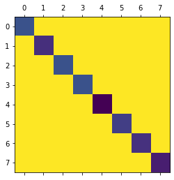
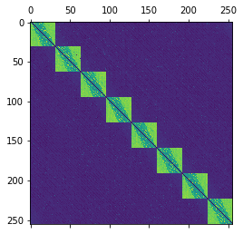
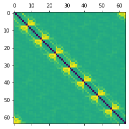

# MPI-TRACER
The realtime monitor for tracing the MPI(Message Passing Interface) program behavior, including  MPI activities and communication performance.

NO NEED to recompile the target MPI application, so it can be used for  3rd party application tracing


## What can MPI-TRACER do?

TotalBytes send among hosts 

  

Max bandwidth among ranks

 

Mean bandwidth among ranks




##  Install 

step1: $ make 

step2: Copy the mpitracer.so to the same path at all hosts


## Usage
1. Run 

Add mpitracer.so as the LD_PRELOAD library 
Use -x LD_PRELOAD=/path/to/mpitracer.so during mpirun

Example:

mpirun  --hostfile myhosts -np 64 -npernode 32  -x LD_PRELOAD=/path/to/mpitracer.so /path/to/MPIApp

2. Get results 

* Find trace log of each process in /dev/shm/mpi_trace_\<rankid\>.log

* Find summary of the task in /var/log/mpi_trace_task_\<start_timestamp\>.log on host of rank 0（Only log pt2pt traffics）

3. Analyze the results

   View the python scripts in scripts/ as a reference

## Parameters 

MPI tracer use environment variables to pass parameters. The available options are listed below.

* MPITRACER_LOG_SIZE

   Log entries per rank, default: 100000

* MPITRACER_TIMER

   The timer used for mearsuring the running time of the methods

   Options:

  ​     GETTIMEOFDAY    use gettimeofday to measure the time 

  ​     TSC                          use TSC to measure the time, CPU Freq should be passed by MPITRACER_TSC_GHZ

* MPITRACER_TSC_GHZ

  Frequence of the CPU to enable TSC timer, eg 2.0 

* MPITRACER_LOG_DIR

  Log path, default: /dev/shm  

* MPITRACER_LOG_PREFIX

  Log file prefix, default: mpi_trace, and the log file will be record as mpi_trace_\<rankid\>.log

* MPITRACER_DELAY_WRITER

  MPI trace will create a writer thread to write the logs to the file on each rank process, you can set MPITRACER_DELAY_WRITER=1 to disable writer thread and don't  flush the logs to file during the application runtime util MPI_Finalize stage

* MPITRACER_THRESHOLD

  MPI trace will log only the MPI behavior with message size larger than MPITRACER_THRESHOLD, default: 0 (log everything)

* MPITRACER_DISABLE_REDUCER

   MPI trace will summary all traces caught in each host and save to a single host, set to 0 to disable it, default: 1 (enable)

* MPITRACER_FOUND_ASYNC_BUG_WARNING

   MPI trace can be used to find program issues in using  non-blocking functions,  eg. MPI_Request is not used in pairs of MPI_Ixxxx and MPI_Wait/Test, set to 0 to disable it, default: 1 (enable)

* MPITRACER_IGNORE

   MPI trace will ignore the designated functions , separate by comma, eg. MPITRACER_IGNORE=MPI_Bcast,MPI_Barrier

Example:

mpirun  --hostfile myhosts -np 64 -npernode 32 -x MPITRACER_TSC_GHZ=2.5 -x MPITRACER_LOG_SIZE=200000 -x MPITRACER_TIMER=GETTIMEOFDAY  -x LD_PRELOAD=/path/to/mpitracer.so /path/to/MPIApp


## Log Format


### Trace Log format
```
       ID                  MPI_TYPE   TimeStamp      Call     Elapse       Comm     Tag     SRC     DST    SCount   SBuf_B   SLen_B SBW_Gbps    RCount   RBuf_B   RLen_B RBW_Gbps
    51925                 MPI_Bcast   53.490958  0.000004   0.000004  0x2bbf780      -1       0      -1       260        8     2080   4.362         0        0        0   0.000
    51926                  MPI_Send   53.490996  0.000098   0.000098  0x2bbe3d0    2329       0       1         1   526344   526344  42.971         0        0        0   0.000
    51927                  MPI_Send   53.491095  0.000003   0.000003  0x2bbe3d0    2329       0       1         1        0        0   0.000         0        0        0   0.000
    51928                  MPI_Send   53.491665  0.000012   0.000012  0x2bbf780    4001       0       1         1     2048     2048   1.374         0        0        0   0.000
    51929                  MPI_Recv   53.498571  0.000083   0.000083  0x2bbe3d0    2330       1       0         0        0        0   0.000         1   526344   526344  50.750
```


| Column    | Descrpition                                                  |
| --------- | ------------------------------------------------------------ |
| MPI_TYPE  | the MPI_xxx functions to hook and log, available functions are listed in the next section |
| TimeStamp | seconds since MPI_Init is called                             |
| Call      | the running time of the called function                      |
| Elapse    | if the function is synchronous, eg MPI_Send, it is equal to Call<br />if the function is asynchronous, eg MPI_Isend, it is the time between the asychronous function being called and its asynchronous request being checked positive by MPI_Test or MPI_Wait |
| Comm      | the Commnunicator of the function                            |
| Tag       | the tag of the function                                      |
| SRC       | the source rank of the function, display -1 if NA            |
| DST       | the destination rank of the function, display -1 if NA       |
| SCount    | the count of buffers for sending                             |
| SBuf_B    | the size of a single buffer for sending, in bytes            |
| SLen_B    | the total size of sending buffer, SLen_B = SCount * SCount, in bytes |
| SBW_Gbps  | the bandwidth of sending process SBW_Gbps = SLen_B/Elapse, formatted to Gbps |
| RCount    | the count of buffers for receiving                           |
| RBuf_B    | the size of a single buffer for receiving, in Bytes          |
| RLen_B    | the total size of receiving buffer, RLen_B = RCount * RBuf_B, in bytes |
| RBW_Gbps  | the bandwidth of receiving process RBW_Gbps = RLen_B/Elapse, formatted to Gbps |


### Task Summary Log format


Pt2pt/bcast/reduce traffic are supportted 

```
          SHost            SRC            DHost            DST       Start          Elapse           TotalCount              TotalBytes         Max_msg         Min_msg         Avg_msg         Max_bw  Min_bw  Avg_bw Bw_mean
        ihostn01              1         ihostn00              0    4.930473      518.642593                42804             24046669008        29360128               4          561785         50.433   0.000   0.371  10.701
        ihostn02              2         ihostn00              0    4.930495      518.656857                13080              1367319360        29245440               4          104535         51.540   0.000   0.021   6.502
        ihostn03              3         ihostn00              0   14.120866      490.132643                 2426              1755566080        29360128            2048          723646         41.648   0.003   0.029   9.031
```

| Column     | Descrpition                                                  |
| ---------- | ------------------------------------------------------------ |
| SHost      | the hostname where source rank located at                    |
| SRC        | the source rank                                              |
| DHost      | the hostname where destination rank located at               |
| DST        | the destination rank                                         |
| Start      | the start time(s)                                            |
| Elapse     | the total time of the communication last between SRC and DST |
| TotalCount | the total messages have been sent                            |
| TotalBytes | the total bytes have been sent, in bytes                     |
| Max_msg    | the max size of all messages, in bytes                       |
| Min_msg    | the min size of all messages, in bytes                       |
| Avg_msg    | the average size of all messages, in bytes                   |
| Max_bw     | the max bandwidth of all traffics between SRC and DST, formatted to Gbps |
| Min_bw     | the min bandwidth of all traffics between SRC and DST, formatted to Gbps |
| Avg_bw     | the average bandwidth of all traffics between SRC and DST, Avg_bw=TotalBytes/Elapse, formatted to Gbps |
| Bw_mean    | the average bandwidth of all traffics between SRC and DST, Bw_mean=Sum(bw)/TotalCount, formatted to Gbps |


## MPI Hooks

The available MPI functions to trace now

MPI_Send

MPI_Recv

MPI_Isend

MPI_Irecv

MPI_Ssend

MPI_Issend

MPI_Wait

MPI_Waitall

MPI_Test

MPI_Testall

MPI_Bcast

MPI_Ibcast

MPI_Reduce

MPI_Ireduce

MPI_Allreduce

MPI_Iallreduce

MPI_Alltoall

MPI_Ialltoall

MPI_Barrier

MPI_Ibarrier


## Notes

* Linux Only
* Works with openmpi or Intelmpi
* Tested on OSU Micro-Benchmarks 5.5 and HPL 2.2
* Tested on mpiGraph
  * there is a bug in mpiGraph, see https://github.com/LLNL/mpiGraph/pull/2/files to fix and run


